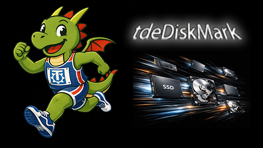
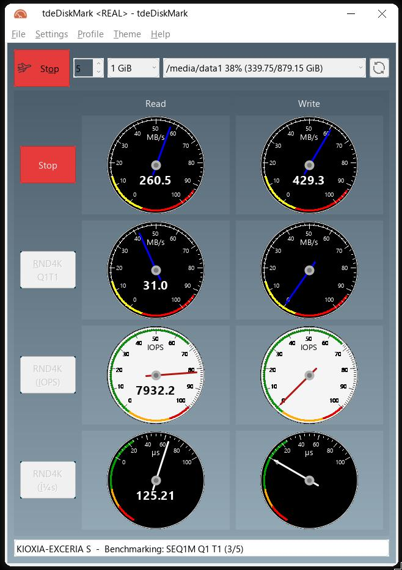
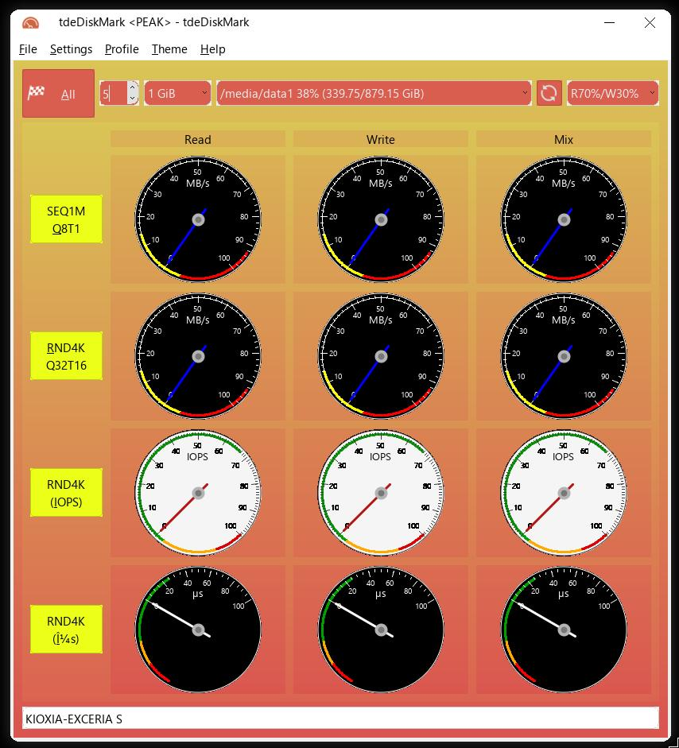
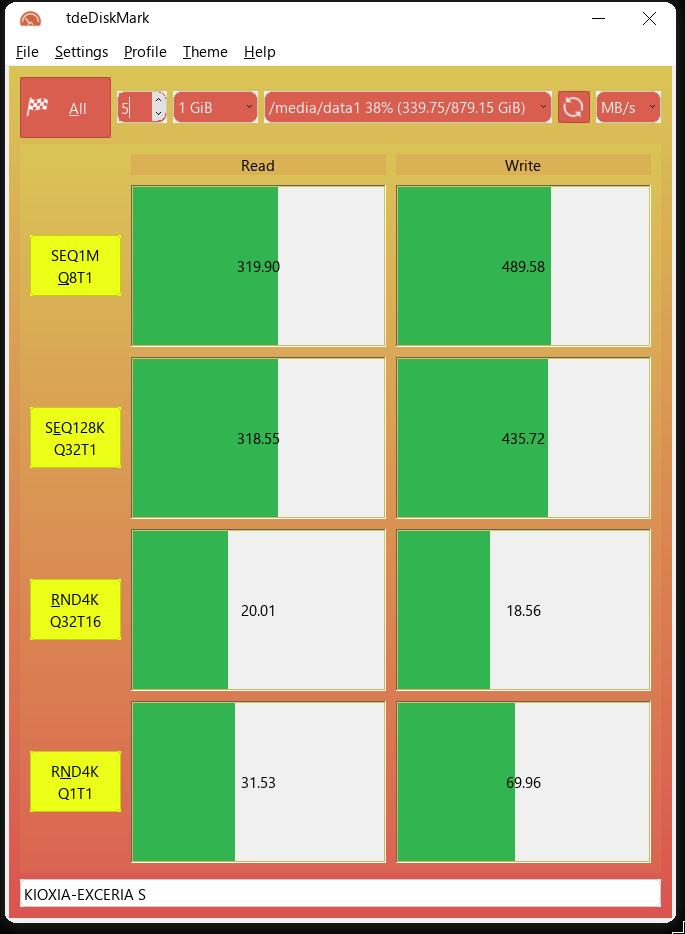
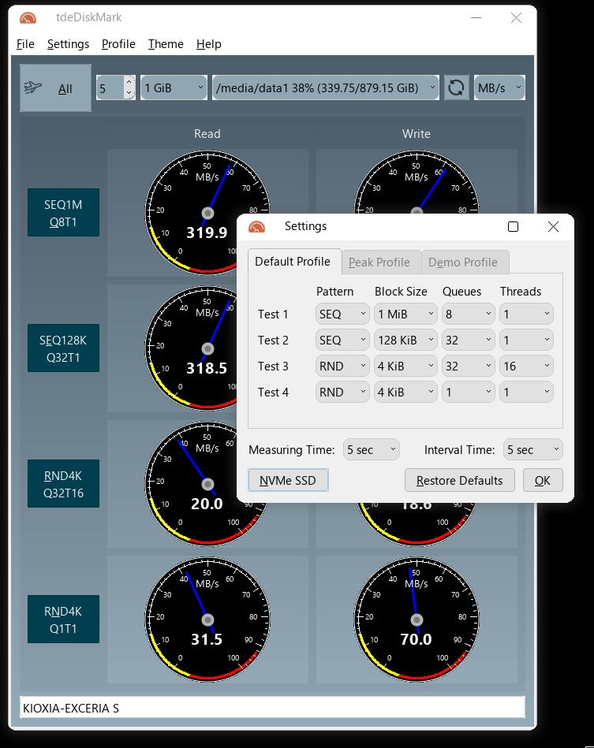

# tdeDiskMark





**tdeDiskMark** is a native [Trinity Desktop Environment (TDE)](https://www.trinitydesktop.org/) port of [KDiskMark](https://github.com/JonMagon/KDiskMark), the popular HDD/SSD benchmark tool. It has been fully rewritten from Qt5/Qt6 to **TQt3** to integrate seamlessly with TDE, while preserving all the power of the original — and adding a few goodies on top ^^

Like its reference, tdeDiskMark calls [Flexible I/O Tester (fio)](https://github.com/axboe/fio) under the hood and presents the results in a clean, easy-to-read interface.

## What's New in tdeDiskMark

Compared to the original KDiskMark:

*  **Fun themes** — "Racing" (orange fire) and "Night Fly" (cool blue), plus a clean "None" theme that follows your TDE system colors of course.
*  **GAUGES!** — Yes, actual animated analog gauges with anti-aliased rendering. Because progress bars are soooooo last century. You can toggle them from the *Theme → Use Gauges* menu and watch your disk speeds on beautiful dials. It's completely unnecessary but I love it.
*  **Desktop notifications** — Get a libnotify popup when your benchmark finishes, so you can go grab a coffee while fio does its thing in case of looong testing sessions.
*  **Fully native TDE** — No Qt5/KDE dependencies. Uses TQt3, tdelibs, and `tdesu` for privilege escalation. Lightweight and fast.

## Report Example
```
                      tdeDiskMark (1.0): https://github.com/seb3773/tdediskmark
                  Flexible I/O Tester (fio-3.30): https://github.com/axboe/fio
--------------------------------------------------------------------------------
* MB/s = 1,000,000 bytes/s [SATA/600 = 600,000,000 bytes/s]
* KB = 1000 bytes, KiB = 1024 bytes

[Read]
Sequential   1 MiB (Q=  8, T= 1):   508.897 MB/s [    497.0 IOPS] < 13840.05 us>
Sequential   1 MiB (Q=  1, T= 1):   438.278 MB/s [    428.0 IOPS] <  2280.14 us>
    Random   4 KiB (Q= 32, T= 1):   354.657 MB/s [  88664.6 IOPS] <   352.37 us>
    Random   4 KiB (Q=  1, T= 1):    44.166 MB/s [  11041.6 IOPS] <    88.48 us>

[Write]
Sequential   1 MiB (Q=  8, T= 1):   460.312 MB/s [    449.5 IOPS] < 15153.11 us>
Sequential   1 MiB (Q=  1, T= 1):   333.085 MB/s [    325.3 IOPS] <  2349.82 us>
    Random   4 KiB (Q= 32, T= 1):   315.170 MB/s [  78792.5 IOPS] <   383.86 us>
    Random   4 KiB (Q=  1, T= 1):    91.040 MB/s [  22760.3 IOPS] <    39.80 us>

Profile: Default
   Test: 1 GiB (x5) [Measure: 5 sec / Interval: 5 sec]
   Date: 2026-04-02 22:00:00
     OS: debian 12 [linux 6.x]
```

## Dependencies

### Required
* **GCC/Clang** with C++17 support
* **CMake** >= 3.10
* **TQt3** (`libtqtinterface-dev`)
* **TDE libraries** (`tdelibs14-trinity-dev`)
* **libnotify** (`libnotify-dev`)
* **fio** — [Flexible I/O Tester](https://github.com/axboe/fio) >= 3.1 (runtime dependency)

### Optional
* **sstrip** (from `elfkickers`) — for maximum binary size reduction

## Installation

### Quick Build (recommended)

```bash
git clone https://github.com/seb3773/tdediskmark.git
cd tdediskmark
./build.sh
```

The `build.sh` script will check for missing dependencies, offer to install them (Debian/Ubuntu), and build an optimized release binary.

The resulting executable will be at `build/tdediskmark`.

### Manual Build

```bash
# Install dependencies (Debian/Ubuntu with Trinity repo enabled)
sudo apt-get install cmake make g++ pkg-config \
    libtqtinterface-dev tdelibs14-trinity-dev libnotify-dev

# Build
mkdir build && cd build
cmake -DCMAKE_BUILD_TYPE=Release ..
make -j$(nproc)
```

### Create a .deb Package

```bash
./create_deb.sh
```

This will clean, rebuild, and package everything into `tdediskmark_v1.0.deb`.

### Cleanup

```bash
./clean.sh
```

Removes the `build/` directory and editor temp files to get a pristine source tree.

## Credits

**tdeDiskMark** is a TDE/TQt3 port by [seb3773](https://github.com/seb3773).

Based on **KDiskMark** by [JonMagon](https://github.com/JonMagon/KDiskMark) — thank you for the excellent original!

**Application Icon** — Based on original KDiskMark icon revisited:  https://www.iconfinder.com/baitisstudio

## License

This project is licensed under the GNU General Public License v3.0 — see [LICENSE](LICENSE) for details.

## Some screenshots:






